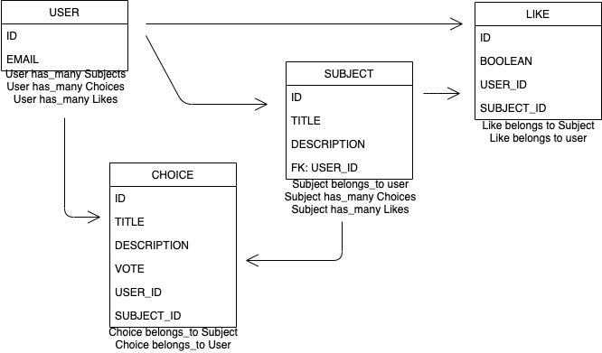

Work in progress!!
# Poll Position API




## Installation

### Setup Environment:
1.  Install dependencies with `bundle install`.
1.  `git add` and `git commit` your changes.
1.  Create a `.env` for sensitive settings (`touch .env`).
1.  Generate new `development` and `test` secrets (`bundle exec rails secret`).
1.  Store them in `.env` with keys `SECRET_KEY_BASE_<DEVELOPMENT|TEST>`
    respectively.
1.  In order to make requests to your deployed API, you will need to set
    `SECRET_KEY_BASE` in the environment of the production API (for example, using `heroku config:set` or the Heroku dashboard).
1.  In order to make requests from your deployed client application, you will
    need to set `CLIENT_ORIGIN` in the environment of the production API (for example, `heroku config:set CLIENT_ORIGIN=https://<github-username>.github.io`).
    See more about deploying to heroku [rails-heroku-setup-guide](https://git.generalassemb.ly/ga-wdi-boston/rails-heroku-setup-guide)

### Setup your database:
    - bin/rails db:drop (if it already exists)
    - bin/rails db:create
    - bin/rails db:migrate
    - bin/rails db:seed
    - bin/rails db:examples

  **Note**: Do this for each database you want to set up. Your local database and production (Heroku) database will both need to be set up in this way!


### Run your server!
1. Run the API server with `bin/rails server` or `bundle exec rails server`.

## API

Use this as the basis for your own API documentation. Add a new third-level
heading for your custom entities, and follow the pattern provided for the
built-in user authentication documentation.

Scripts are included in [`curl-scripts`](curl-scripts) to test built-in actions. Add your
own scripts to test your custom API. As an alternative, you can write automated
tests in RSpec to test your API.

### Subjects Endpoints and Curl Scripts

| Verb   | URI Pattern            | Controller#Action |
|--------|------------------------|-------------------|
| POST   | `/subjects`            | `subjects#create` |
| GET    | `/subjects`            | `subjects#index`  |
| GET    | `/subjects/:id`        | `subjects#show`   |
| DELETE | `/subjects/:id`        | `subject#destroy` |
| PATCH  | `/subjects/:id`        | `subject#update`  |

#### POST /create

Request:

```sh
curl "http://localhost:4741/subjects" \
  --include \
  --request POST \
  --header "Content-Type: application/json" \
  --header "Authorization: Token token=${TOKEN}" \
  --data '{
    "subject": {
      "title": "'"${TITLE}"'",
      "description": "'"${DESCRIPTION}"'"
    }
  }'
```
```sh
TOKEN="xxxxxxxxx" TITLE="Title" DESCRIPTION="Description" sh curl-scripts/subjects/create.sh
```

Response:

```md
HTTP/1.1 201 Created
Content-Type: application/json; charset=utf-8

{
  "subject": {
    "id": 1,
    "title": "Title",
    "description": "Description"
  }
}
```
### Authentication Endpoints and Curl Scripts

| Verb   | URI Pattern            | Controller#Action |
|--------|------------------------|-------------------|
| POST   | `/sign-up`             | `users#signup`    |
| POST   | `/sign-in`             | `users#signin`    |
| PATCH  | `/change-password`     | `users#changepw`  |
| DELETE | `/sign-out`        | `users#signout`   |

#### POST /sign-up

Request:

```sh
curl http://localhost:4741/sign-up \
  --include \
  --request POST \
  --header "Content-Type: application/json" \
  --data '{
    "credentials": {
      "email": "'"${EMAIL}"'",
      "password": "'"${PASSWORD}"'",
      "password_confirmation": "'"${PASSWORD}"'"
    }
  }'
```

```sh
EMAIL=ava@bob.com PASSWORD=hannah curl-scripts/auth/sign-up.sh
```

Response:

```md
HTTP/1.1 201 Created
Content-Type: application/json; charset=utf-8

{
  "user": {
    "id": 1,
    "email": "ava@bob.com"
  }
}
```

#### POST /sign-in

Request:

```sh
curl http://localhost:4741/sign-in \
  --include \
  --request POST \
  --header "Content-Type: application/json" \
  --data '{
    "credentials": {
      "email": "'"${EMAIL}"'",
      "password": "'"${PASSWORD}"'"
    }
  }'
```

```sh
EMAIL=ava@bob.com PASSWORD=hannah curl-scripts/auth/sign-in.sh
```

Response:

```md
HTTP/1.1 200 OK
Content-Type: application/json; charset=utf-8

{
  "user": {
    "id": 1,
    "email": "ava@bob.com",
    "token": "BAhJIiVlZDIwZTMzMzQzODg5NTBmYjZlNjRlZDZlNzYxYzU2ZAY6BkVG--7e7f77f974edcf5e4887b56918f34cd9fe293b9f"
  }
}
```

#### PATCH /change-password

Request:

```sh
curl --include --request PATCH "http://localhost:4741/change-password" \
  --header "Authorization: Token token=$TOKEN" \
  --header "Content-Type: application/json" \
  --data '{
    "passwords": {
      "old": "'"${OLDPW}"'",
      "new": "'"${NEWPW}"'"
    }
  }'
```

```sh
OLDPW='hannah' NEWPW='elle' TOKEN='BAhJIiVlZDIwZTMzMzQzODg5NTBmYjZlNjRlZDZlNzYxYzU2ZAY6BkVG--7e7f77f974edcf5e4887b56918f34cd9fe293b9f' sh curl-scripts/auth/change-password.sh
```

Response:

```md
HTTP/1.1 204 No Content
```

#### DELETE /sign-out

Request:

```sh
curl http://localhost:4741/sign-out \
  --include \
  --request DELETE \
  --header "Authorization: Token token=$TOKEN"
```

```sh
TOKEN='BAhJIiVlZDIwZTMzMzQzODg5NTBmYjZlNjRlZDZlNzYxYzU2ZAY6BkVG--7e7f77f974edcf5e4887b56918f34cd9fe293b9f' sh curl-scripts/auth/sign-out.sh
```

Response:

```md
HTTP/1.1 204 No Content
```

### Keeping your database up to date

Remember, creating and applying [migrations](https://edgeguides.rubyonrails.org/active_record_migrations.html#creating-a-migration) are two different things. After you create a migration (one of those files that lives in `db/migrate/`), you need to apply it to each database using `bin/rails db:migrate` (local) or `heroku run rails db:migrate` (production).

### Rolling Back a Database Migration

Sometimes you need to revert a migration that you already applied. There are many ways to revert your database to a previous state, and one of the most common is simply rolling back (reverting) the last migration that you ran. Read more in the [Rails Guide](https://edgeguides.rubyonrails.org/active_record_migrations.html#rolling-back)

### Reset Database without dropping

If you don't want to completely [reset the database](https://edgeguides.rubyonrails.org/active_record_migrations.html#resetting-the-database) (maybe you have data you want to preserve?), you have other, less destructive options. One is rolling back a specific migration by specifying the `VERSION` that the database should revert to. Ask a consultant if you need assistance, as **database commands like these are non-reversable.**

To rerun _all_ migrations, starting from `VERSION=0`, you would do:


```sh
bin/rails db:migrate VERSION=0
bin/rails db:migrate db:seed db:examples
```

To run this command (and others like this) on Heroku, just append `heroku run` before the `rails` command.


## Additional Resources
- [rails-heroku-setup-guide](https://git.generalassemb.ly/ga-wdi-boston/rails-heroku-setup-guide)
- [Rails Guides: API-only app](http://guides.rubyonrails.org/api_app.html)
- [Building a JSON API with Rails 5](https://blog.codeship.com/building-a-json-api-with-rails-5/)

## [License](LICENSE)

1.  All content is licensed under a CC­BY­NC­SA 4.0 license.
1.  All software code is licensed under GNU GPLv3. For commercial use or
    alternative licensing, please contact legal@ga.co.
